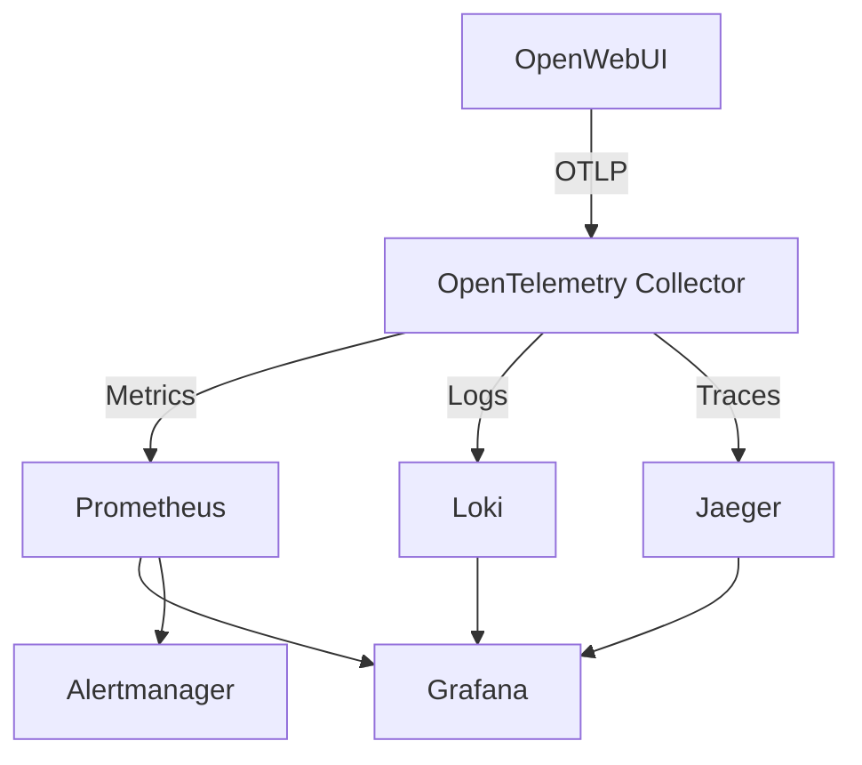

# OpenWebUI Analytics Observability Setup

Complete **Grafana + Prometheus + Loki + Jaeger + OpenTelemetry** stack for monitoring OpenWebUI Analytics.

## 🚀 Quick Start

### 1. Start the Observability Stack

```bash
# Navigate to the observability directory
cd observability

# Start all services
docker-compose -f docker-compose.observability.yml up -d
```

### 2. Configure OpenWebUI with Telemetry

Add these environment variables to enable OpenTelemetry in OpenWebUI:

```bash
# .env or environment variables
ENABLE_OTEL=true
ENABLE_OTEL_TRACES=true
ENABLE_OTEL_METRICS=true
ENABLE_OTEL_LOGS=true

# OTLP endpoints (pointing to our collector)
OTEL_EXPORTER_OTLP_ENDPOINT=http://localhost:4317
OTEL_SERVICE_NAME=open-webui
```

### 3. Start OpenWebUI

```bash
# Start OpenWebUI with telemetry enabled
ENABLE_OTEL=true OTEL_EXPORTER_OTLP_ENDPOINT=http://localhost:4317 uv run open-webui serve
```

### 4. Access Dashboards

- **Grafana**: http://localhost:3000 (admin/admin)
- **Prometheus**: http://localhost:9090
- **Jaeger**: http://localhost:16686
- **Loki**: http://localhost:3100

## 📊 What You'll See

### Automatic Metrics (No Code Changes)
- `openwebui_http_server_requests_total` - All HTTP requests
- `openwebui_http_server_duration_seconds` - Request latencies
- `openwebui_webui_users_total` - Total registered users
- `openwebui_webui_users_active` - Currently active users

### Analytics-Specific Metrics
- `openwebui_analytics_requests_total` - Analytics API calls
- `openwebui_analytics_cache_operations_total` - Cache hits/misses
- `openwebui_analytics_errors_total` - Analytics errors
- `openwebui_analytics_database_query_duration_seconds` - DB performance

### Distributed Traces
- Full request flow visualization
- Database query tracing
- Cross-service correlation

### Structured Logs
- JSON logs with trace correlation
- Searchable in Grafana via Loki
- Analytics operation logging

## 🔧 Configuration Files

```
observability/
├── docker-compose.observability.yml    # Complete stack definition
├── otel-collector-config.yml          # OpenTelemetry Collector config
├── prometheus.yml                      # Metrics scraping config
├── loki-config.yml                     # Log aggregation config
├── alert-rules.yml                     # Prometheus alerting rules
└── grafana-provisioning/               # Grafana auto-configuration
    ├── datasources/
    │   └── datasources.yml
    └── dashboards/
        └── dashboard.yml
└── grafana-dashboards/                 # Pre-built dashboards
    └── analytics-dashboard.json
```

## 📈 Key Metrics to Monitor

### Performance Metrics
```promql
# Average response time for analytics endpoints
rate(openwebui_http_server_duration_seconds_sum{route=~".*analytics.*"}[5m]) /
rate(openwebui_http_server_duration_seconds_count{route=~".*analytics.*"}[5m])

# Request rate
rate(openwebui_analytics_requests_total[5m])

# Error rate
rate(openwebui_analytics_errors_total[5m]) / rate(openwebui_analytics_requests_total[5m])
```

### Cache Performance
```promql
# Cache hit rate
rate(openwebui_analytics_cache_operations_total{result="hit"}[5m]) /
rate(openwebui_analytics_cache_operations_total[5m])
```

### Database Performance
```promql
# Average database query time
rate(openwebui_analytics_database_query_duration_seconds_sum[5m]) /
rate(openwebui_analytics_database_query_duration_seconds_count[5m])
```

## 🚨 Built-in Alerts

The stack includes pre-configured alerts for:

- **High Error Rate**: >10% error rate for 2 minutes
- **Slow Responses**: >2 second average response time
- **Low Cache Hit Rate**: <70% cache hit rate
- **Slow DB Queries**: >1 second average query time
- **Service Down**: OpenWebUI unavailable

## 🔍 Troubleshooting

### Check Service Health
```bash
# OpenTelemetry Collector
curl http://localhost:13133

# Prometheus
curl http://localhost:9090/-/healthy

# Loki
curl http://localhost:3100/ready

# Grafana
curl http://localhost:3000/api/health
```

### View Container Logs
```bash
# All services
docker-compose -f docker-compose.observability.yml logs

# Specific service
docker-compose -f docker-compose.observability.yml logs otel-collector
docker-compose -f docker-compose.observability.yml logs prometheus
docker-compose -f docker-compose.observability.yml logs grafana
```

### Verify OpenWebUI is Sending Telemetry
```bash
# Check OTEL Collector logs for incoming data
docker-compose -f docker-compose.observability.yml logs otel-collector | grep "otlp"

# Check Prometheus targets
curl http://localhost:9090/api/v1/targets
```

## 🛠️ Customization

### Adding More Metrics
Edit `backend/open_webui/cogniforce_models/analytics_otel.py` to add custom metrics:

```python
# Add new counter
NEW_METRIC = meter.create_counter(
    name="analytics_custom_metric_total",
    description="Custom analytics metric"
)

# Use in your code
NEW_METRIC.add(1, {"operation": "custom_operation"})
```

### Modifying Dashboards
1. Edit `grafana-dashboards/analytics-dashboard.json`
2. Or create dashboards in Grafana UI and export them

### Alert Configuration
Edit `alert-rules.yml` to modify alert thresholds and conditions.

## 📚 Architecture



**Benefits:**
- ✅ **Zero vendor lock-in** - All open source
- ✅ **Industry standard** - OpenTelemetry is CNCF standard
- ✅ **Scalable** - Handles high-volume production workloads
- ✅ **Complete observability** - Metrics, logs, and traces
- ✅ **Easy to extend** - Add more services and metrics

## 🎯 Next Steps

1. **Start the stack**: `docker-compose -f docker-compose.observability.yml up -d`
2. **Enable OpenWebUI telemetry**: Add environment variables
3. **Use analytics API**: Generate some traffic to see metrics
4. **Explore Grafana**: View the pre-built dashboard
5. **Set up alerts**: Configure notifications (Slack, email, etc.)

Your analytics system now has **enterprise-grade observability**! 🎉